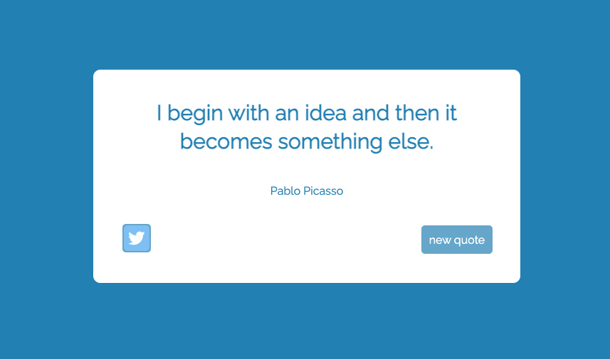

# 🔥 FreeCodeCamp - Random Quote Machine

[🔗 Random Quote Guide](https://fcc-react-random-quote.vercel.app/)

### Description

This project is a react app project from [FreeCodeCamp](https://www.freecodecamp.org/learn)'s Course [Front End Development Libraries](https://www.freecodecamp.org/learn/front-end-development-libraries/). The Random Quote Machine application is showing a new random quote when user clicks 'new quote' button.

---

### Built with

- JavaScript
- [React](https://reactjs.org/) - JS library
- CSS
- Sass

##### Icon Source

- [Twitter icon](https://www.flaticon.com/free-icons/twitter-logo) created by riajulislam - Flaticon

---

### How to use

1. Open the link on the top of Description
2. Click the 'new quote' button
   then it will show you a new random quote!

---

### What I learned new here!

- How to make a random color change when a button clicks by using useState().
